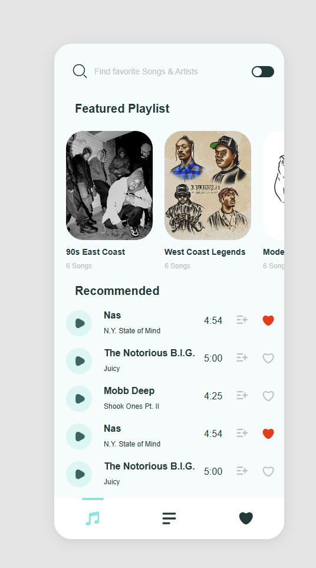

# 🎵 Songify – Music Library App

A responsive music library app built with React and TypeScript, supporting dark/light modes and mobile/desktop layouts.

## 📸 Screenshots

### 💻 Desktop View


### 📱 Mobile View



## 🚀 Getting Started

```bash
npm install
npm run dev
```

## ⚠️ Challenges Faced

- Usually when I'm doing these types of assigments, I try to setup my project completely from the stretch without bootstraping it with any of the popular tools. I did it as well this time, however, for some reason, Typescript didn't recognize my css file - that is usually fixed by d.ts files, but I just could not get it done this time, so not to lose too much time, I decided to go with Vite to bootstrap - I'm using it for the first time so honestly, I don't really know how it works behind the scenes.
- Time constraint was the big one
- Some icons I could not export properly
- Could not really figure out from the UX how song is added to the playlist, so I decided to add it whenever user expends one of the playlists in the Modal. I started working on Friday evening, so I could not send email to ask.

 ## 🚧Missing Features (Time Constraint)

- Transitions - many are not done or not done quite the same. I just didn't have time to cover all of it, so I had to choose lesser evil of all, at least from my point of view. Also, to be honest, I haven't written 10 keyframes in the last 3 years, so they would probably take me the most time.
- Modals - only for Desktop View. 

## 💡 Implementation Hacks

- At the very end I started passing some styles directly inline, it is in very few spaces, I had an idea to refactor it later, but couldn't get it done in time.
- I don't think it pixel perfect, but I tried to be as close as possible.


